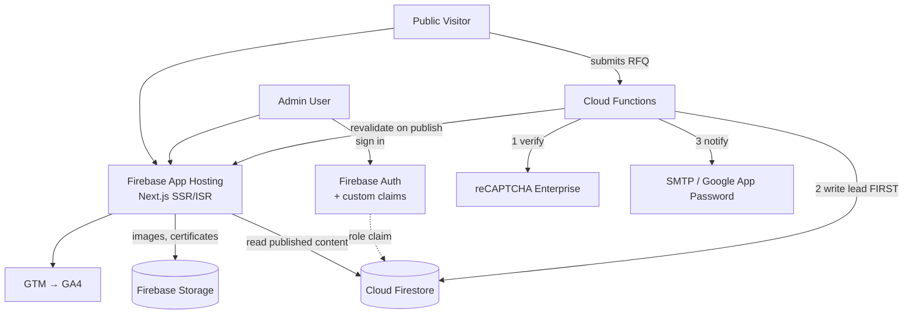
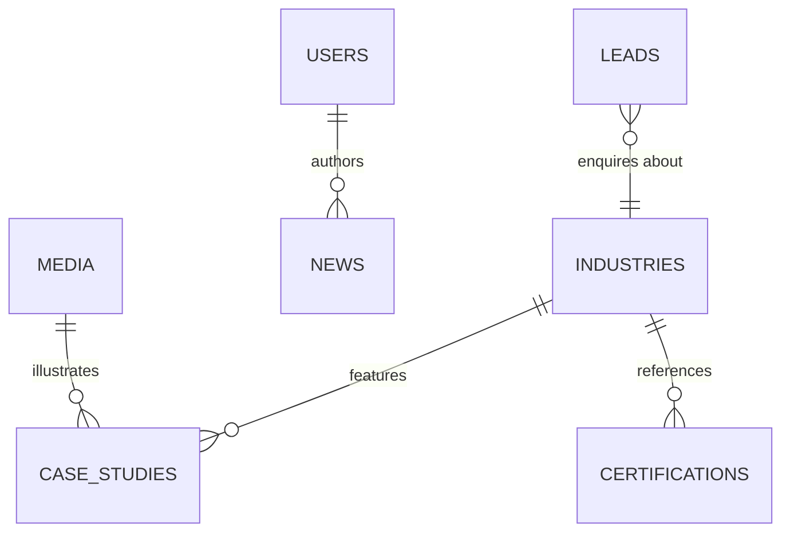

# INFINI — Product Requirements Document

**Project:** Complete revamp of `infini.co.in`
**Repository:** `Humble-Coders/Infini` (private)
**Status:** Foundation spec — every brief and ticket references this document
**Last updated:** 2026-08-08

---

## 1. Overview & Vision

INFINI is an established Indian precision **surface-finishing** company. It applies the **MMP (Micro Machining Process)** — a mechanical-physical-chemical treatment performed in treatment tanks — to components manufactured by its customers, selectively removing frequencies of roughness to deliver controlled finishes up to mirror-like quality.

> **Positioning note — read this before writing any copy.** INFINI does *not* manufacture parts. It finishes parts other companies make. Copy that positions INFINI as a "manufacturer" is factually wrong and will be rejected. The correct frame is: *a specialist surface-finishing partner to precision manufacturers.*

The current website is a dated WordPress build that under-sells the company: it does not communicate the value proposition quickly, does not present certifications or proven work as credible evidence, has weak performance and a poor security posture, and cannot be updated by the INFINI team without a developer.

**Vision:** transform `infini.co.in` into a modern, premium industrial brand website — a credible digital presence that makes a procurement lead or design engineer immediately understand what INFINI does, trust its capability, and submit an enquiry — backed by an admin panel that lets the INFINI team run the site themselves.

`https://mmptechnology.com/` is the client's stated quality benchmark. It is the **global sibling brand for the same MMP technology**, not an unrelated site. Use it to calibrate visual quality, typography, spacing, motion and content presentation. **Do not clone it.** The output must read as *INFINI, the Indian MMP specialist*, with its own identity.

### Success criteria

| | Measure |
|---|---|
| **Primary** | Increase in qualified Request-a-Quote submissions vs the current site |
| **Comprehension** | A first-time visitor understands what INFINI does within the first screen or two |
| **Autonomy** | INFINI staff publish news, case studies, testimonials and events with zero developer involvement |
| **SEO** | No loss of existing organic ranking through migration; industry pages indexable and structured |
| **Trust** | Certifications and case studies presented as verifiable evidence, not decoration |

---

## 2. Goals & Non-Goals

### Goals
1. A complete, production-ready public website that replaces the current site in full.
2. All **7 industry pages** with genuinely distinct, SEO-structured content.
3. A credibility spine: Company & Capabilities, Certifications, Case Studies.
4. Request a Quote as a first-class conversion path, reachable from every page.
5. A role-based admin panel covering all routinely-changing content.
6. A leads dashboard with reliable email notification.
7. Technical SEO foundation: server-rendered metadata, sitemap, structured data, 301 migration.
8. Security hardening — from a poor rating today to a defensible posture.
9. Measurable performance on mobile, not just desktop.

### Non-Goals (explicitly out of v1)
- A drag-and-drop page builder. The admin panel is a **CMS, not a website builder** — structural and layout changes remain developer work.
- Multi-language / i18n. Content is English-only for v1. *(Build strings so this isn't painful later, but ship no translation layer.)*
- E-commerce, quoting engine, pricing calculators, or customer self-service portals.
- Customer-facing login. **Firebase Auth is for admin users only.**
- Native mobile apps.
- Migrating WordPress content automatically — content is refreshed and re-entered, not imported.
- Replacing the MMP global brand site or unifying with it.

---

## 3. Target Users

### A. Public visitors (unauthenticated)
Procurement teams, design and manufacturing engineers, quality managers, existing customers, and businesses evaluating surface-finishing partners. They arrive from search, referral or the MMP global site.

Their jobs-to-be-done, in order:
1. Work out what INFINI does and whether it applies to their component.
2. Confirm INFINI is credible — certifications, real work, facility, capacity.
3. Find industry-specific relevance to their own sector.
4. Submit an enquiry with enough detail to get a useful reply.

### B. Admin users (authenticated)

Three roles. The architecture must never assume a single admin or a single permission level.

| Role | Content CRUD | Media | Leads | Users & Settings |
|---|---|---|---|---|
| **Super Admin** | ✅ | ✅ | ✅ | ✅ |
| **Content Editor** | ✅ | ✅ | ❌ | ❌ |
| **Leads Manager** | ❌ | ❌ | ✅ | ❌ |

Roles are stored on the user document **and** mirrored into Firebase Auth **custom claims**, because Firestore security rules must enforce authorization server-side — never trust a role read from client state.

---

## 4. System Architecture

### 4.1 Stack

| Layer | Choice |
|---|---|
| Framework | **Next.js (App Router)**, React, TypeScript-optional (repo is currently JS) |
| Styling | **Tailwind CSS** + existing shadcn/Radix primitives |
| Hosting | **Firebase App Hosting** (native Next.js SSR support) |
| Database | **Cloud Firestore** |
| File storage | **Firebase Storage** |
| Auth | **Firebase Authentication** (admin only, email/password) |
| Server logic | **Cloud Functions** — email dispatch, reCAPTCHA verification, revalidation hooks |
| Email | **SMTP via Google App Password** (Nodemailer in a Cloud Function) |
| Analytics | **GA4** via **Google Tag Manager** |
| Bot protection | **reCAPTCHA Enterprise** |

> **Architectural change from the starting repo.** The repo shipped as a **Vite client-rendered SPA**. That cannot satisfy this project's SEO requirements: social and AI crawlers (LinkedIn, WhatsApp, Slack, Facebook, most LLM fetchers) do not execute JavaScript, so `react-helmet` tags are invisible to them and every page would preview as an empty shell. Next.js was chosen to serve real per-page HTML and metadata. This still honours the brief's "React + Tailwind" requirement, and the migration cost is near-zero because the repo contained only a placeholder page. **See Decision D1.**

### 4.2 Rendering strategy

| Page type | Strategy | Why |
|---|---|---|
| Home, Company, Capabilities, Certifications, Industries | **SSG + ISR** | Content changes rarely; must be instant and fully crawlable |
| Case studies, News, Events (list + detail) | **SSG + ISR**, revalidated on publish | CMS-driven; must go live without a redeploy |
| Contact, Request a Quote | **Server component + client form island** | Form needs interactivity; page needs indexable HTML |
| `/admin/**` | **Client-side, `noindex`** | Private, auth-gated, SEO-irrelevant |

Publishing from the admin panel triggers an on-demand revalidation so content appears without a rebuild.

### 4.3 Firestore data model

| Collection | Purpose | Key fields |
|---|---|---|
| `users` | Admin accounts | `uid`, `email`, `name`, `role`, `active`, `createdAt` |
| `industries` | The 7 industry pages | `slug`, `name`, `order`, `hero`, `overview`, `capabilities[]`, `applications[]`, `materials[]`, `relatedCertIds[]`, `relatedCaseStudyIds[]`, `seo`, `published` |
| `pages` | Singleton page content (home, company, capabilities, contact) | `id`, `sections[]`, `seo` |
| `caseStudies` | Proven work | `slug`, `title`, `industryId`, `challenge`, `solution`, `process`, `result`, `beforeImage`, `afterImage`, `gallery[]`, `specs`, `seo`, `published`, `publishedAt` |
| `certifications` | Certificates as real content | `name`, `logoUrl`, `certificateNumber`, `issuedDate`, `validUntil`, `description`, `fileUrl`, `order`, `published` |
| `news` | Blog / insights | `slug`, `title`, `excerpt`, `body`, `coverImage`, `tags[]`, `status` (draft/published), `publishedAt`, `authorId`, `seo` |
| `testimonials` | Social proof | `quote`, `personName`, `designation`, `company`, `logoUrl`, `order`, `published` |
| `events` | Trade shows, announcements | `title`, `startDate`, `endDate`, `location`, `description`, `images[]`, `link`, `published` |
| `leads` | Enquiries — **never deleted by non-super-admins** | `name`, `company`, `email`, `phone`, `enquiryType`, `industryId`, `message`, `sourcePage`, `status`, `createdAt`, `notes[]` |
| `media` | Asset library index | `url`, `path`, `filename`, `alt`, `width`, `height`, `sizeBytes`, `uploadedBy`, `uploadedAt` |
| `settings` | Global site config | `contact`, `social`, `nav`, `defaultSeo`, `cookieBanner` |

**SEO metadata lives as a `seo` map on each content document** (`title`, `description`, `ogTitle`, `ogDescription`, `ogImage`, `canonical`, `noindex`) rather than in a separate collection — it is always fetched with its content and can never drift out of sync.

### 4.4 Security model

- **Firestore rules:** public read restricted to `published == true` documents in public collections. `leads` is **write-only from the server** — no client read, no client write; the Cloud Function is the only writer. All admin writes gated on a verified `role` custom claim.
- **Storage rules:** public read on published asset paths; writes only for Editor/Super Admin. Enforce content-type and file-size limits.
- **Admin routes** protected by middleware *and* rules — never by UI hiding alone.
- **Security headers** via App Hosting config: HSTS, `X-Content-Type-Options`, `X-Frame-Options`/`frame-ancestors`, `Referrer-Policy`, `Permissions-Policy`, and a CSP.
- **No secrets in the frontend.** SMTP credentials, reCAPTCHA secret key and any service-account material live only in Cloud Functions config/Secret Manager.

---

## 5. Feature Specification

### 5.1 Design system (build this first)

The starting repo shipped a **dark charcoal + gold + Playfair Display** theme. **That is not the INFINI brand and must be removed entirely.**

INFINI's identity is **red / black / white**. Build a sophisticated palette *around* that core — supporting neutrals, tints, shades and restrained gradients are welcome — but the site must still unmistakably read as INFINI. Deliver tokens for: primary, supporting, backgrounds, surfaces, typography scale and weights, spacing, radii, buttons, cards, forms, icons, interaction states, and section styles.

Target: **industrial credibility + modern technology + premium presentation + usability.** Explicitly not a generic manufacturing template, not a Bootstrap-grade corporate site, not an MMP copy, and not the current site recoloured. Motion should be purposeful and must never cost mobile performance.

### 5.2 Homepage
Communicates INFINI's value proposition within the first screen or two: who INFINI is, what it does, which industries it serves, why it is credible, and what to do next. Sections: hero with clear proposition; MMP technology explainer; industries grid (7); credibility band (certifications, capability stats); selected case studies; testimonials; latest news; strong closing CTA. **Request a Quote is prominent here and on every page.**

### 5.3 Industry pages (×7)
Each must carry genuinely unique content — never a name-swapped clone.

| Slug | Industry | Priority |
|---|---|---|
| `cutting-tools` | Cutting Tools | 🔴 India priority |
| `forge-stamping-die` | Forge, Stamping & Die | 🔴 India priority |
| `plastic-injection-molds` | Plastic Injection Molds | 🔴 India priority |
| `medical-implants` | Medical Implants | ISO 13485 must be referenced here |
| `aerospace` | Aerospace | |
| `additive-manufacturing` | Additive Manufacturing | |
| `gears-transmission` | Gears & Transmission | |

Each page: industry overview · INFINI's relevance · applicable capabilities · products/applications · materials · relevant certifications · linked case studies · industry imagery · Request a Quote CTA.

### 5.4 Company & Capabilities
A credibility page covering company history and background, the facility, manufacturing/treatment capabilities, production capacity, materials handled, typical lead times, and process technologies.

### 5.5 Certifications
Certificates are content, not logos. Each entry: name, logo, description, certificate number where available, issue and renewal/validity dates, and a **download** action that is visibly obvious. Held today: **ISO 9001, ISO 13485, ISO 14001, ISO 45001**, plus Udyam registration. ISO 13485 must also surface on the Medical Implants page.

### 5.6 Case Studies
Component/project · industry · challenge · prior situation · INFINI's solution · process detail · measurable result · **before/after comparison** · imagery · technical data. Must be linkable both ways: `Industry page → related case studies → case study detail`.

### 5.7 News / Blog
Admin-managed posts with title, body, images, metadata, tags, and **draft/published** state. Serves both freshness and ongoing SEO.

### 5.8 Testimonials
Admin-managed quote, person, designation, company, logo, display order, publish/unpublish.

### 5.9 Events
Admin-managed title, dates, location, description, images, optional link, publish/unpublish.

### 5.10 Request a Quote — the conversion path
Reachable from every page. Captures contact name, company, email, phone, industry/service, requirement detail and message. Submission sequence is strict:

1. Client-side validation
2. reCAPTCHA Enterprise verification (server-side)
3. **Write the lead to Firestore first**
4. Dispatch the email notification
5. Show an explicit success state
6. Fire the GA4 conversion event via GTM

> Step 3 precedes step 4 deliberately. Email is the least reliable link in the chain — **a lead must never be lost because SMTP failed.** See Decision D4.

### 5.11 Admin panel
Sections: Dashboard · Leads · Pages · Industries · Company/Capabilities · Certifications · Case Studies · News · Testimonials · Events · Media · Users · Settings. Every section is permission-gated per §3B. Leads view supports status tracking and internal notes.

### 5.12 Legal
Privacy Policy, Terms & Conditions, and a cookie consent mechanism that genuinely gates analytics/tracking. All reachable from the footer.

---

## 6. Non-Functional Requirements

**Performance.** Compressed and correctly-formatted images (AVIF/WebP via `next/image`), responsive sources, lazy loading below the fold, optimised font loading, caching and CDN/edge delivery, minimal JavaScript, and restrained animation. Mobile performance is the bar, not desktop.

**Responsive.** Designed and tested on desktop, laptop, tablet and mobile. The mobile experience is designed, not a squeezed desktop: proper mobile navigation, readable type, generous spacing, touch-friendly targets, **tap-to-call phone number**, responsive imagery.

**Accessibility.** Semantic HTML, correct heading hierarchy, meaningful alt text, keyboard navigability, visible focus states, adequate contrast.

**SEO.** Server-rendered per-page titles, descriptions and Open Graph tags — admin-editable where content is admin-managed. Clean URLs, canonical tags, structured data (`Organization`, `Article`, `BreadcrumbList`), `sitemap.xml`, `robots.txt`, internal linking between industries/capabilities/case studies, search engine registration and sitemap submission.

**AI / search-agent readiness.** Clear hierarchy, semantic markup, explicit relationships between industries → capabilities → case studies, and crawlable server-rendered content. Next.js delivers this structurally; content must not undermine it.

**Browser/device QA.** Chrome, Safari, Edge, Firefox across Windows, macOS, Android and iOS at mobile/tablet/desktop resolutions.

**Backup & DR.** Configure scheduled Firestore backups after handover so production data is not a single point of failure.

---

## 7. URL Migration Plan

The current site is WordPress. Twelve live URLs were recovered from its sitemap. **Four of them are process/capability pages carrying independent search intent** — those keep their exact slugs, because redirecting a ranking keyword page into a generic hub discards its value.

| Old URL | New URL | Action |
|---|---|---|
| `/aero/` | `/industries/aerospace` | **301** |
| `/forge-stamping-die/` | `/industries/forge-stamping-die` | **301** |
| `/additive-fabrication/` | `/industries/additive-manufacturing` | **301** |
| `/medical/` | `/industries/medical-implants` | **301** |
| `/plastic-injection-molds/` | `/industries/plastic-injection-molds` | **301** |
| `/cutting-tools/` | `/industries/cutting-tools` | **301** |
| `/transmissions/` | `/industries/gears-transmission` | **301** |
| `/technology/` | `/technology` | **Keep slug** |
| `/validation/` | `/validation` | **Keep slug** |
| `/deburring-polishing/` | `/deburring-polishing` | **Keep slug** |
| `/mirror-like-finish/` | `/mirror-like-finish` | **Keep slug** |
| `/contact/` | `/contact` | **Keep slug** (normalise trailing slash) |

Redirects are implemented in `next.config.js` and verified before go-live. The mapping must be re-checked against Google Search Console data during discovery in case indexed URLs exist outside the sitemap.

---

## 8. Delivery Plan

Approximately six weeks from kickoff.

| Phase | Weeks | Output |
|---|---|---|
| 1 — Discovery | 1 | Content/asset collection, final sitemap, old-URL audit, redirect map, Firebase project |
| 2 — Design | 1–2 | Design system, homepage and key layouts, admin direction |
| 3 — Development | 2–4 | Public site, Firestore backend, admin panel, leads, SEO, analytics, security |
| 4 — Staging | 4 | Private staging URL, internal testing, client review |
| 5 — Final QA | 5 | Cross-device/browser, SEO, performance, security, form and redirect testing |
| 6 — Production | 6 | Production config, `infini.co.in` cutover, redirects, analytics, go-live |

**The unfinished site must never be served from `infini.co.in`.** Development runs against a private staging URL; the client reviews there before cutover.

---

## 9. Open Decisions

Unresolved items requiring the client. None block the start of design or development.

| # | Decision | Owner | Needed by |
|---|---|---|---|
| O1 | Final Request-a-Quote field list | Client | Before §5.10 build |
| O2 | Exact admin user list and role assignment | Client | Before staging review |
| O3 | Which existing images/certificates carry over vs. need re-shooting | Client | Discovery |
| O4 | Final top-level navigation labels | Manager | End of design phase |
| O5 | DNS/registrar access for `infini.co.in` cutover | Client | Week 5 |
| O6 | GA4 + GTM account ownership — client property or agency-created | Client | Before analytics wiring |
| O7 | Notification recipient list for new enquiries | Client | Before §5.10 build |
| O8 | Google Search Console access for the old-URL audit | Client | Discovery |

---

## 10. Decision Log

Locked decisions. Changing any of these requires an explicit new decision recorded here.

| # | Decision | Rationale | Trade-off accepted |
|---|---|---|---|
| **D1** | **Next.js (App Router) on Firebase App Hosting**, replacing the Vite SPA shell | The brief requires dynamic meta tags, OG previews, sitemap and AI-crawlability. Client-rendered Vite cannot deliver these — non-JS crawlers see an empty shell. Still React + Tailwind, so the stack rule holds. | Departs from a literal reading of "use the existing repo architecture". Cost is near-zero: the repo held only a placeholder page. Deferring this decision would have made it unaffordable by week 4. |
| **D2** | **Developer drafts page copy; client approves** | 7 genuinely unique industry pages plus Company/Capabilities is substantial original writing. Waiting on client copy would stall the build. | Copywriting is real scoped work, not incidental. Client sign-off is a dependency before go-live. |
| **D3** | **Developer designs in-code; no Figma phase** | Matches the brief's grant of significant creative freedom and protects the six-week timeline. | No design sign-off gate before build. **Mitigation: an explicit design-direction checkpoint at the end of week 2** so week 4 is not the client's first sight of the look. |
| **D4** | **Firestore-first persistence, then Cloud Function dispatch over SMTP via Google App Password** | The lead is durably stored before any email is attempted, so delivery is a notification concern and never the system of record. No new vendor, no ongoing cost; permitted by the brief. **This ordering is the specified design, not a workaround.** | Weaker deliverability to corporate inboxes, Gmail send limits, no bounce visibility, and app passwords break on Google account policy changes. Because Firestore is the source of truth, an email failure degrades notification only — no enquiry is ever lost. Send failures must be logged and surfaced in the admin dashboard so a silent SMTP outage cannot go unnoticed. |
| **D5** | **Developer creates and owns the Firebase/GCP project during build; ownership transfers to the agency and then to INFINI at handover** *(revised 2026-08-08 — supersedes the original agency-owned decision)* | Blaze plan is required for App Hosting, Cloud Functions and reCAPTCHA Enterprise. Developer ownership removes every setup dependency and lets ticket 1 start immediately. | Weakest handover path of the options considered: transferring a project between personal Google accounts is manual and error-prone. **Mandatory mitigation — the project must be reproducible from the repo, not just transferable:** `firestore.rules`, `storage.rules`, `firestore.indexes.json` and `firebase.json` are committed as code; all console-only configuration (App Hosting backends, env vars, reCAPTCHA keys, authorised domains) is documented in `docs/INFRA.md` as it is created, not reconstructed at handover. Treat the project as disposable infrastructure. |
| **D6** | **Three admin roles: Super Admin / Content Editor / Leads Manager** | Matches the realistic team shape and satisfies the brief's requirement that the system never assume one admin or one permission level. Simple to enforce in Firestore rules. | Not per-module granular. If the client later needs finer control, the role field extends to a permission map without a data migration. |
| **D7** | **Legacy capability URLs keep their exact slugs**; only industry pages are restructured under `/industries/` | `/technology/`, `/validation/`, `/deburring-polishing/` and `/mirror-like-finish/` target independent search intent. Folding them into a generic hub would discard accumulated ranking. | Slightly less tidy URL taxonomy than a fully uniform structure. SEO value outweighs neatness. |
| **D8** | **Roles enforced via Firebase Auth custom claims + Firestore rules** | Authorization must be server-side. UI-level role checks are trivially bypassed. | Requires a Cloud Function to set claims on role change, and claim propagation is not instant on the client. |
| **D9** | **English-only for v1** | No i18n requirement in the brief; adds cost without demand. | Strings should be authored so a future i18n layer is not a rewrite. |
| **D10** | **Repo `Humble-Coders/Infini`, private, `main` as trunk** | Established at project setup. | — |

---

## 11. Reference

- Current site: `https://infini.co.in` (WordPress, being replaced)
- Quality benchmark: `https://mmptechnology.com/` — global MMP sibling brand; calibrate against, do not copy
- Process pipeline: [`docs/PROCESS.md`](./PROCESS.md)
- Architecture rules for developers: `CLAUDE.md` (repo root)
