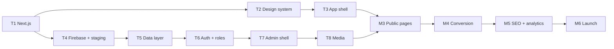

# INFINI — Build Roadmap

26 tickets across 6 milestones, ~6 weeks. One focused job per ticket.

**Tickets are drafted one milestone ahead, not all at once.** Detail written in week 1 for work that happens in week 5 is detail that gets rewritten — by then the design system exists, the data model is real, and the ticket would be wrong. Run `/draft-ticket <what>` to flesh out the next milestone when the current one is underway.

**Status:** M1 drafted and issued. M2–M6 are planned scope below.

---

## M1 — Foundation ✍️ *drafted*

The ground everything stands on. Nothing else starts until T1 merges.

| # | Ticket | Depends on |
|---|---|---|
| T1 | Migrate Vite → Next.js + TypeScript; purge foreign brand assets | — |
| T2 | INFINI design system + `/styleguide` | T1 |
| T3 | App shell — header, navigation, footer, Request-a-Quote CTA | T2 |
| T4 | Firebase wiring + staging deployment + infra docs | T1 *(parallel with T2/T3)* |

🚩 **Gate:** T2's `/styleguide` is the design-direction review. T9 must not start before it happens.

---

## M2 — Data & Admin

The backend and the panel INFINI staff will actually use. Built before public pages so pages read from a real model rather than hardcoded content that has to be torn out later.

| # | Ticket | Notes |
|---|---|---|
| T5 | Firestore schema, typed data accessors, security rules | All queries live in `lib/data/` |
| T6 | Admin auth — Firebase Auth, custom claims, 3 roles, route guard | Super Admin / Content Editor / Leads Manager |
| T7 | Admin shell — layout, navigation, dashboard | Permission-gated per role |
| T8 | Media library — Storage upload, image management, alt text | Feeds every content type |

---

## M3 — Public content

The customer-facing site. Each content type ships with its admin CRUD in the same ticket, so nothing is ever publishable-but-unmanageable.

| # | Ticket | Notes |
|---|---|---|
| T9 | Homepage | Value proposition within the first screen or two |
| T10 | Industry pages (×7) + admin CRUD | Genuinely unique content each — not name-swapped clones |
| T11 | Company & Capabilities | History, facility, capacity, materials, lead times |
| T12 | Certifications + download | ISO 9001 / 13485 / 14001 / 45001; 13485 also on Medical |
| T13 | Case studies + admin CRUD | Before/after; cross-linked from industry pages |
| T14 | News / blog + admin CRUD | Draft and published states |
| T15 | Testimonials + Events + admin CRUD | Ordering, publish/unpublish |
| T16 | Legacy capability pages | `/technology`, `/validation`, `/deburring-polishing`, `/mirror-like-finish` — keep exact slugs |

---

## M4 — Conversion

The commercial point of the site.

| # | Ticket | Notes |
|---|---|---|
| T17 | Request a Quote — form, Cloud Function, reCAPTCHA, email | **Firestore write precedes email send** |
| T18 | Leads dashboard | Status tracking, internal notes, email-failure visibility |

---

## M5 — SEO, analytics & legal

The contracted deliverables that are invisible until they're missing.

| # | Ticket | Notes |
|---|---|---|
| T19 | SEO — per-page metadata, sitemap, structured data | Admin-editable where content is admin-managed |
| T20 | 301 redirects + URL migration | The 12-URL map in PRD §7. **Launch-blocking.** |
| T21 | GA4 + GTM + Request-a-Quote event tracking | |
| T22 | Legal — Privacy, Terms, cookie consent | Consent must genuinely gate tracking |

---

## M6 — Hardening & launch

| # | Ticket | Notes |
|---|---|---|
| T23 | Security hardening — headers, rules audit, penetration pass | Current site rates poorly; this is an explicit requirement |
| T24 | Performance optimization | Mobile is the bar, not desktop |
| T25 | Cross-browser / cross-device QA | Chrome, Safari, Edge, Firefox × Win, macOS, Android, iOS |
| T26 | Production deployment + `infini.co.in` cutover | Redirects live, analytics verified, Firebase project transfer |

---

## Dependency shape

---

## Client-side open items

These sit outside the ticket flow and need chasing. Full list in [`docs/PRD.md`](./PRD.md) §9.

| Item | Needed by |
|---|---|
| Official brand assets — logo vector, guidelines, photography | T2 *(interim assets acceptable, flag if low-res)* |
| Google Search Console access for the old-URL audit | T20 |
| DNS / registrar access for `infini.co.in` | T26 |
| GA4 + GTM account ownership | T21 |
| Final Request-a-Quote field list | T17 |
| Enquiry notification recipient list | T17 |
| Admin user list and role assignment | T6 |
